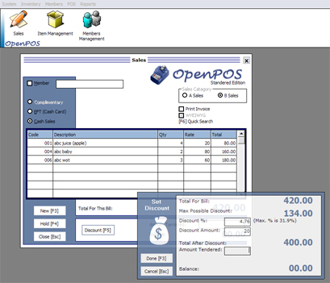

## OpenPOS

### Description

This is a POS i am developing for a friend of mine. This is the Beta test release. It's fully functional except for the reporting and user management. POS fits fine for a small single shop. Simple DB functions are used gud to have a look into, and flex grid is used for data entry... with the old tricks, and the UI is pritty cool i think ;) .(updated with the ocx, it's names as HoverButton.oc_ , just rename it as .ocx b4 u open the project, hope it works this time, thanks for the support. really appriciate it guys.)
 
### More Info
 

             |
---                |---
**Submitted On**   |2002-08-17 18:25:20
**By**             |[Sofwathullah Mohamed](https://github.com/Planet-Source-Code/PSCIndex/blob/master/ByAuthor/sofwathullah-mohamed.md)
**Level**          |Advanced
**User Rating**    |4.9 (97 globes from 20 users)
**Compatibility**  |VB 6\.0
**Category**       |[Complete Applications](https://github.com/Planet-Source-Code/PSCIndex/blob/master/ByCategory/complete-applications__1-27.md)
**World**          |[Visual Basic](https://github.com/Planet-Source-Code/PSCIndex/blob/master/ByWorld/visual-basic.md)
**Archive File**   |[OpenPOS1324249172002\.zip](https://github.com/Planet-Source-Code/sofwathullah-mohamed-openpos__1-39047/archive/master.zip)

### API Declarations

Some win2k/winxp api stuff is used to make the froms transparent, if are on 98 or ME, just comment them out and it'll work fine.

